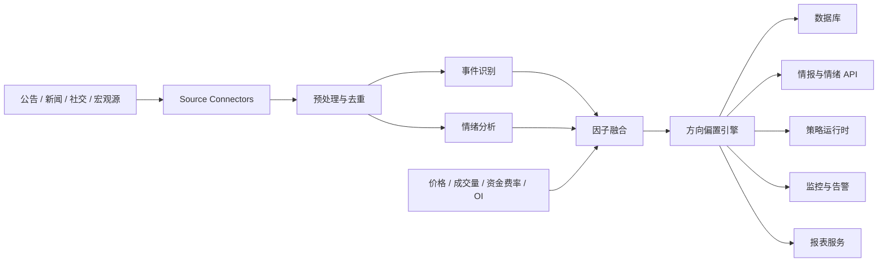

# 实时情报与市场情绪分析工具设计文档

> 文档层级：研究与情报层
>  
> 推荐读者：量化研究员、NLP 工程师、数据工程师、风控负责人
>  
> 建议前置阅读：[需求分析](./quant_trading_requirements_analysis.md) / [详细功能规格](./quant_trading_detailed_function_spec.md)
>  
> 相关文档：[量化因子库](./quant_trading_factor_library_and_implementation_guide.md) / [组合、风控与交易方法框架](./quant_trading_portfolio_risk_and_trading_methods_framework.md)

## 1. 文档目标

本文档专门定义量化交易系统中的“实时情报与市场情绪分析工具”，目标是为交易和研究提供一个能够：

- 实时搜集市场信息
- 分析市场情绪
- 输出上涨 / 下跌方向偏置
- 生成可回测、可监控、可解释的辅助信号

需要明确的是：

- 该工具输出的是概率化判断，不是绝对预测
- 该工具是策略和风控的输入之一，不应绕过执行和风控主链路

## 2. 工具定位

该工具定位为“情报引擎 + 情绪引擎 + 方向偏置引擎”的组合模块。

它解决的核心问题是：

- 当市场价格尚未完全反映信息时，尽早捕捉事件驱动和情绪驱动机会
- 将新闻、公告、舆情和市场异动统一为可量化信号
- 让策略不仅看价格，也能看“信息流”和“情绪流”

## 3. 输出定义

### 3.1 文档级输出

针对单条新闻、公告或社交文本，输出：

- 情绪标签：`BULLISH` / `BEARISH` / `NEUTRAL`
- 情绪分数：`-1.0 ~ 1.0`
- 热度分数
- 相关标的
- 事件类型
- 置信度

### 3.2 标的级输出

针对单个标的和时间窗口，输出：

- 聚合情绪分数
- 事件冲击分数
- 市场确认分数
- 方向标签：`BULLISH` / `BEARISH` / `NEUTRAL`
- 上涨概率
- 下跌概率
- 中性概率
- 信号有效期

### 3.3 解释性输出

每个方向偏置信号建议附带：

- 主要驱动事件
- 主要信息来源
- 支撑因子摘要
- 风险提示

## 4. 数据源设计

### 4.1 一级优先数据源

这些数据源建议纳入 MVP：

- 交易所公告
- 财经新闻快讯
- RSS 新闻源
- 价格、成交量、波动率
- 资金费率
- 未平仓量
- 爆仓和大额异动数据

### 4.2 二级扩展数据源

这些数据源建议在第二阶段接入：

- X / Twitter
- Reddit
- Telegram 频道
- 行业论坛
- 链上地址异动
- 宏观日历和经济数据

### 4.3 数据源优先级原则

- 先接高价值、结构清晰、延迟低的数据源
- 先接公告和财经新闻，再扩社交媒体
- 先做少量高质量源，不做全网低质量抓取

## 5. 功能拆解

### 5.1 信息源接入器

职责：

- 接入不同来源的数据
- 处理鉴权、限频、断线重连
- 输出统一原始文档对象

输入：

- RSS / REST / WebSocket / Scraper 数据

输出：

- 原始文档流

### 5.2 文档预处理器

职责：

- 正文抽取
- HTML 清洗
- 去重
- 语言识别
- 时间标准化
- 标的映射

关键方法：

- 正则清洗
- 内容哈希
- SimHash / MinHash 去重
- 关键词匹配和别名映射

### 5.3 事件识别器

职责：

- 判断信息属于哪类事件
- 识别是否为高冲击事件

建议事件分类：

- 上币 / 下币
- 黑客攻击
- 政策监管
- ETF / 宏观政策
- 清算 / 爆仓
- 项目融资 / 合作
- 产品发布 / 升级

### 5.4 情绪引擎

职责：

- 对文本输出情绪标签和情绪分数
- 区分整体情绪和对特定标的的情绪

推荐实现：

- 规则词典
- 轻量金融文本分类模型
- 中文金融情绪模型
- LLM 做摘要和解释，非必须实时主链路

### 5.5 热度与扩散引擎

职责：

- 评估事件传播速度和讨论热度
- 识别情绪是否正在扩散

输入特征：

- 文本数量变化率
- 相似内容传播速度
- 来源权重
- 社交互动量

### 5.6 市场确认引擎

职责：

- 检查信息和市场行为是否相互确认

输入特征：

- 短期价格动量
- 成交量放大
- 资金费率变化
- 未平仓量变化
- 爆仓方向
- 多空比变化

输出：

- `market_confirmation_score`

### 5.7 方向偏置引擎

职责：

- 将情绪、事件、热度和市场确认特征融合为方向偏置信号

输出建议：

- `up_probability`
- `down_probability`
- `neutral_probability`
- `confidence_score`
- `horizon`
- `valid_until`

注意事项：

- 必须区分不同时间窗口
- 不同时间窗口的权重和模型应独立
- 低置信度信号不应直接驱动强交易动作

### 5.8 信号服务与告警

职责：

- 提供查询接口
- 把重要情绪异动推送给监控与告警服务
- 为策略和报表提供统一接口

## 6. 系统流程设计

## 7. 模型设计建议

### 7.1 MVP 模型方案

MVP 不建议一开始就使用复杂的大模型端到端预测，建议采用分层方案：

1. 规则词典做基础情绪判断
2. 分类模型做情绪和事件分类
3. 结构化市场特征做确认和过滤
4. 逻辑回归 / 梯度提升树输出方向概率

这样做的优点：

- 更容易解释
- 更容易调试
- 更容易回测
- 工程复杂度更低

### 7.2 二阶段模型方案

可以逐步扩展为：

- 多语言金融文本模型
- LLM 做事件摘要和因果解释
- 图模型做事件传播建模
- 多模态信号融合

## 8. 数据落库建议

建议至少落以下四类数据：

- 原始文档
- 文档级情绪结果
- 标的级聚合情绪结果
- 方向偏置信号

建议直接使用以下表：

- `intel.sources`
- `intel.documents`
- `intel.sentiment_scores`
- `intel.directional_signals`

## 9. 策略集成方式

推荐三种接入方式：

### 9.1 作为过滤器

例子：

- 原策略出现做多信号，但情绪为强空，则降低仓位或不交易

### 9.2 作为增强因子

例子：

- 在趋势因子基础上叠加情绪因子，提高信号置信度

### 9.3 作为独立事件策略输入

例子：

- 上币公告、ETF 审批、监管消息触发专门事件驱动策略

## 10. 风控集成方式

情绪模块也可用于风控，而不只是用于下单：

- 负面情绪急剧恶化时降低风险暴露
- 高冲击事件出现时暂停相关标的开仓
- 极端舆情和市场异动共振时触发风险告警

## 11. MVP 范围建议

### 11.1 MVP 必做

- 接入交易所公告
- 接入财经新闻快讯
- 文本清洗和去重
- 基础情绪分类
- 基础事件分类
- 聚合情绪分数
- 方向偏置信号输出
- 情绪日报和异常告警

### 11.2 MVP 暂不优先

- 全网社交媒体全量接入
- 多语言复杂大模型推理
- 复杂知识图谱
- 细粒度事件因果链建模

## 12. 评估指标

建议至少跟踪以下评估指标：

- 情绪分类准确率
- 事件分类准确率
- 方向偏置命中率
- 置信度校准误差
- 信息采集延迟
- 高价值事件覆盖率
- 信号平均提前量

## 13. 主要风险

- 信息噪声高，误报多
- 社交媒体内容重复和操纵严重
- 情绪强但市场不确认
- 模型过拟合历史热点事件
- 数据源授权和稳定性问题

## 14. 实施建议

建议按以下顺序落地：

1. 先做交易所公告和新闻快讯
2. 先做文档级情绪分数和事件标签
3. 再做标的级方向偏置信号
4. 再把信号接入回测和实时策略
5. 最后扩展到社交媒体和更复杂模型

## 15. 结论

实时情报与市场情绪分析工具，不应被理解为一个“猜涨跌页面”，而应被建设为：

- 一个标准化的信息处理系统
- 一个可解释的情绪信号系统
- 一个可回测的方向偏置系统
- 一个能和策略、风控、报表联动的核心模块

这样它才真正对量化交易系统有长期价值。
