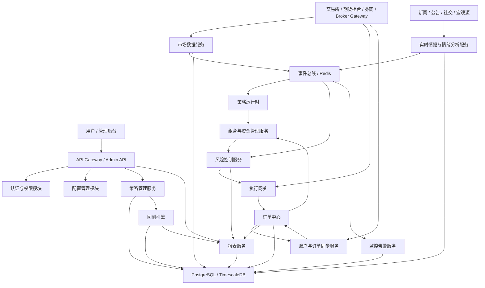
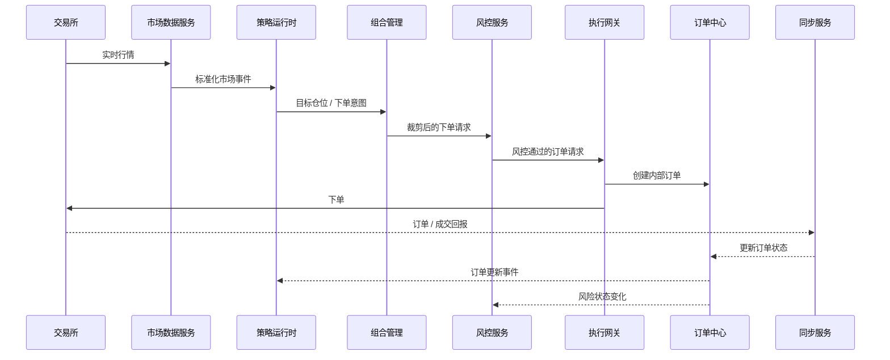
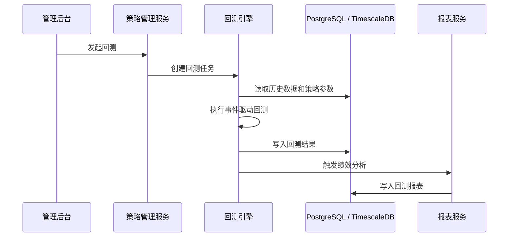
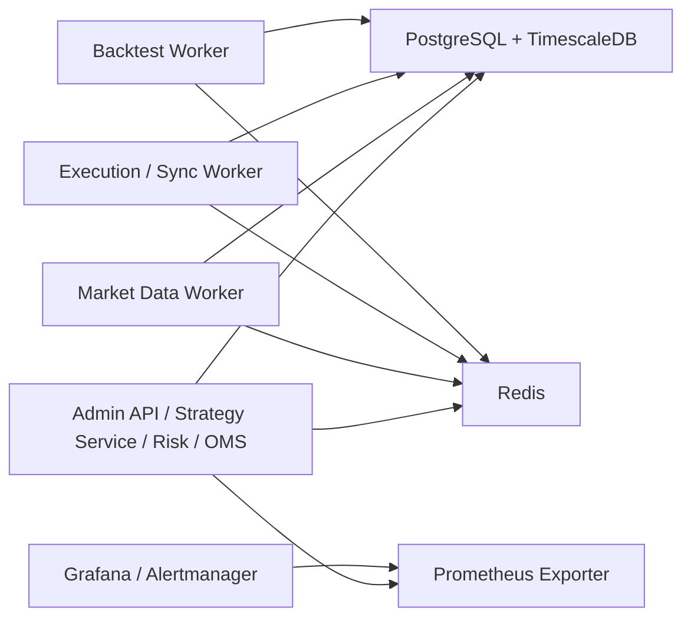

# 量化交易工具系统架构设计文档

> 文档层级：平台设计层
>  
> 推荐读者：架构师、后端工程师、数据工程师、运维负责人
>  
> 建议前置阅读：[需求分析](./quant_trading_requirements_analysis.md) / [详细功能规格](./quant_trading_detailed_function_spec.md)
>  
> 相关文档：[数据库设计](./quant_trading_database_schema_design.md) / [增强版 API](./quant_trading_enhanced_api_interface_definition.md) / [编码前准备](./quant_trading_pre_implementation_readiness_plan.md)

## 1. 文档目标

本文档用于定义 `quant_exchange` 的系统架构设计，承接以下两份文档：

- [quant_trading_requirements_analysis.md](./quant_trading_requirements_analysis.md)
- [quant_trading_detailed_function_spec.md](./quant_trading_detailed_function_spec.md)

本文档重点回答以下问题：

- 系统拆成哪些模块和服务
- 服务之间如何通信
- 关键交易链路如何流转
- MVP 应如何部署和演进

## 2. 架构范围与前提

### 2.1 第一阶段业务范围

MVP 架构从第一天开始兼容“加密货币市场 + 标准化期货市场 + 股票市场”。为了控制交付风险，首个可交付版本建议先跑通单一市场闭环，但核心模型、接口和数据结构必须预留三类市场扩展能力。

优先支持：

- 单市场接入
- 单账户、单柜台或单券商通道
- 加密货币现货 / 永续 / 交割合约，单一期货品类，或 A 股 / 港股 / 美股现金股票
- K 线驱动策略
- 基础实时情报采集和情绪分析
- 回测、模拟盘、实盘闭环

### 2.2 技术前提

建议第一阶段采用多语言分层技术栈：

- Python：研究、回测、因子、NLP / ML
- Rust：实时行情热路径、OMS / EMS、执行网关、热路径风控
- Go：控制面 API、账户同步、任务编排、运维接口
- 数据库：PostgreSQL
- 时序扩展：TimescaleDB
- 缓存与事件通道：Redis
- 监控：Prometheus + Grafana

详细说明见：[quant_trading_polyglot_technology_stack_design.md](./quant_trading_polyglot_technology_stack_design.md)

### 2.3 设计原则

- 风控优先于执行
- 数据统一优先于策略复杂度
- 回测、模拟盘、实盘共享策略核心逻辑
- 所有关键状态变化必须可审计
- 服务边界清晰，先单体模块化，再逐步服务化
- MVP 优先稳定和正确，后续再扩展性能和分布式能力

## 3. 总体架构

### 3.1 逻辑架构图

### 3.2 分层说明

系统建议拆成六层：

1. 接入层
   - 管理后台 API
   - 市场接入适配器
2. 领域服务层
   - 市场数据
   - 实时情报与情绪分析
   - 策略管理
   - 执行管理
   - 风险控制
   - 组合管理
   - 报表分析
3. 运行时层
   - 策略运行时
   - 回测引擎
   - 模拟盘执行器
4. 基础设施层
   - PostgreSQL / TimescaleDB
   - Redis
   - 日志与监控
5. 控制平面
   - 用户、权限、配置、审计
6. 运维与观察层
   - 指标
   - 告警
   - 复盘与审计

## 4. 模块划分与职责

### 4.1 API Gateway / Admin API

职责：

- 提供管理后台接口
- 统一接入认证、鉴权、审计
- 管理账户、策略、风控规则、部署、报表查询

主要接口：

- `/auth/*`
- `/accounts/*`
- `/strategies/*`
- `/backtests/*`
- `/orders/*`
- `/risk/*`
- `/reports/*`
- `/system/*`

MVP 设计建议：

- 第一阶段仍可保持单仓库管理
- 但运行时应允许控制面、研究面、执行面采用不同语言进程独立部署
- 控制面 API 推荐独立为 Go 服务

### 4.2 认证与权限模块

职责：

- 用户认证
- RBAC 权限控制
- 高风险操作二次确认
- 审计日志输出

关键能力：

- 区分研究员、交易员、管理员、风控员
- 记录用户对策略、账户、风控的所有修改

### 4.3 配置管理模块

职责：

- 管理系统配置、交易所配置、策略参数、风控参数
- 维护配置版本
- 支持配置回滚

关键设计：

- 配置全部入库
- 高风险配置变更需审计
- 环境配置与业务配置分离

### 4.4 市场数据服务

职责：

- 历史数据采集
- 实时行情订阅
- 数据标准化
- 数据清洗与落库
- 向策略和回测提供统一数据接口

内部子组件：

- Exchange Adapter
- Historical Data Loader
- Streaming Consumer
- Normalizer
- Data Quality Checker
- Data Query Service

关键输出：

- `KlineEvent`
- `TradeTickEvent`
- `FundingRateEvent`
- `InstrumentUpdatedEvent`

### 4.5 策略管理服务

职责：

- 管理策略元数据
- 管理策略版本、参数、部署记录
- 触发回测、模拟盘、实盘运行
- 管理策略状态启停

内部子组件：

- Strategy Registry
- Strategy Config Manager
- Strategy Version Manager
- Strategy Runner Controller

### 4.6 策略运行时

职责：

- 消费市场数据事件和情报事件
- 调用策略逻辑生成信号
- 输出目标仓位或订单意图
- 与组合、风控、执行服务协作

运行模式：

- 回测模式
- 模拟盘模式
- 实盘模式

设计要求：

- 运行时与策略代码解耦
- 通过统一 `StrategyContext` 向策略提供数据和账户状态
- 每次运行生成唯一 `run_id`

### 4.7 回测引擎

职责：

- 加载历史数据
- 驱动策略运行
- 模拟撮合、手续费、滑点、资金费率、保证金
- 输出绩效指标、权益曲线和交易流水

关键设计：

- 事件驱动
- 可复现
- 参数化运行
- 支持批量回测

MVP 范围：

- K 线级回测
- 单账户
- 单策略
- 市价单 / 限价单基础模拟

### 4.8 组合与资金管理服务

职责：

- 对目标仓位进行组合层裁剪
- 分配资金配额
- 聚合风险敞口
- 管理多策略共享资金

MVP 简化方案：

- 单账户固定资金配额
- 单策略情况下保留接口，逻辑先简化

### 4.9 风险控制服务

职责：

- 下单前硬门禁校验
- 运行中风控监测
- 风险事件触发和熔断
- 全局 kill switch

规则层次：

- 订单级
- 标的级
- 策略级
- 账户级
- 系统级

关键设计：

- 风控规则配置化
- 风控结果必须带原因码
- 风控动作必须落审计

### 4.10 执行网关

职责：

- 接收风控通过后的下单请求
- 路由到指定交易所 adapter
- 执行下单、撤单、改单
- 返回交易所响应

设计要求：

- 幂等
- 可重试
- 状态可恢复
- 交易所无关

### 4.11 订单中心 OMS

职责：

- 存储内部订单
- 维护订单状态机
- 管理内部订单与交易所订单映射
- 输出订单事件和成交事件

订单状态建议：

- `NEW`
- `PENDING_SUBMIT`
- `SUBMITTED`
- `PARTIALLY_FILLED`
- `FILLED`
- `CANCELED`
- `REJECTED`
- `FAILED`
- `UNKNOWN`

### 4.12 账户与订单同步服务

职责：

- 通过 WebSocket / REST 同步订单状态
- 同步持仓和余额
- 执行定时对账
- 修复系统与交易所状态偏差

关键设计：

- WebSocket 实时同步
- REST 周期性补偿
- 未知状态订单进入待确认队列

### 4.13 监控告警服务

职责：

- 采集业务与系统指标
- 管理告警规则
- 分发通知
- 记录告警处理过程

监控对象：

- 服务健康
- 行情延迟
- 订单延迟
- 风控触发频次
- 账户权益和回撤

### 4.14 报表服务

职责：

- 生成策略和账户报表
- 生成回测与实盘偏差报表
- 生成日报、周报、月报
- 为管理后台提供查询接口

### 4.15 通知服务

职责：

- 统一封装邮件、Telegram、企业微信、钉钉发送逻辑
- 支持告警、日报、审批通知

### 4.16 实时情报与情绪分析服务

职责：

- 采集交易所公告、财经新闻、社交文本和宏观事件
- 执行去重、语言识别、实体识别和事件分类
- 计算情绪分数、热度分数和事件严重度
- 融合结构化市场数据生成方向偏置信号
- 向策略、监控和报表输出标准化情报事件

内部子组件：

- Source Connector
- Content Normalizer
- NLP Pipeline
- Event Classifier
- Sentiment Engine
- Directional Bias Engine
- Signal API

关键输出：

- `intel.document.ingested`
- `intel.sentiment.updated`
- `intel.directional_bias.updated`

## 5. 核心业务链路设计

### 5.1 实时交易主链路

### 5.2 回测链路

### 5.3 订单对账链路

1. 同步服务定时拉取交易所开放订单
2. 与 OMS 中状态非终态订单比对
3. 若本地缺失交易所状态，则写入异常事件
4. 若交易所已成交但本地未更新，则补写成交流水并修正持仓
5. 若长期未知，则告警并进入人工处理队列

### 5.4 实时情报链路

1. 情报服务从新闻、公告、社交和宏观源采集文本
2. 预处理模块进行清洗、去重、语言识别和标的映射
3. NLP 管道输出情绪标签、事件类别、热度分数
4. 方向引擎融合价格、成交量、资金费率、未平仓量等数据
5. 生成带时间窗口和置信度的方向偏置信号
6. 信号通过事件总线发给策略运行时、监控和报表服务

## 6. 服务边界与接口约定

### 6.1 服务通信方式

MVP 建议采用“同步契约调用 + 异步事件总线”的混合方案：

- 同语言服务内部模块之间：进程内调用
- 跨语言服务之间：gRPC / Protobuf 或 HTTP / JSON
- 异步事件传播：Redis Pub/Sub 或 Redis Stream
- 定时任务：Go scheduler 或 Python worker 调度
- 管理台访问：HTTP / JSON

原因：

- 能快速落地
- 降低服务拆分成本
- 保留未来演进到微服务的空间

### 6.2 内部事件模型

建议定义统一事件信封：

- `event_id`
- `event_type`
- `event_time`
- `source`
- `account_id`
- `strategy_id`
- `run_id`
- `payload`

主要事件类型：

- `market.kline.closed`
- `market.trade.tick`
- `intel.document.ingested`
- `intel.sentiment.updated`
- `intel.directional_bias.updated`
- `strategy.signal.generated`
- `risk.order.blocked`
- `risk.kill_switch.triggered`
- `order.created`
- `order.updated`
- `trade.executed`
- `position.updated`
- `alert.triggered`

### 6.3 外部适配器接口

为市场接入 adapter 定义统一接口：

- `fetch_instruments()`
- `fetch_trading_calendar()`
- `fetch_corporate_actions()`
- `fetch_klines(symbol, interval, start, end)`
- `subscribe_ticker(symbols)`
- `subscribe_order_updates()`
- `get_market_status()`
- `get_account_snapshot()`
- `place_order(order_request)`
- `cancel_order(order_id)`
- `get_open_orders()`
- `get_positions()`

## 7. 数据存储架构

### 7.1 存储分工

- PostgreSQL
  - 用户、账户、策略、订单、风控、报表、审计、情报文档和情绪信号
- TimescaleDB
  - K 线、账户快照、持仓快照
- Redis
  - 实时缓存
  - 事件通道
  - 短期状态和幂等键

第二阶段可扩展：

- ClickHouse
  - Tick 和订单簿明细
- 对象存储
  - 原始行情 JSON、原始新闻文本、回测文件、导出报表

### 7.2 数据一致性原则

- 订单和成交流水以数据库为准
- 交易所状态为外部事实源，需周期对账
- 实时缓存只做加速，不作为最终事实存储
- 每个关键事件必须可回放
- 情报信号必须保留时间窗口和置信度，便于回放和评估

## 8. 部署架构设计

### 8.1 MVP 部署拓扑

MVP 推荐部署方式：

- 1 台应用服务器
- 1 台数据库服务器
- 可选 1 台监控服务器

如果资源有限，可以合并为 1 台测试机 + 1 台数据库机进行开发验证。

### 8.2 进程建议

- `api-server`
- `market-data-worker`
- `strategy-runtime-worker`
- `execution-sync-worker`
- `backtest-worker`
- `scheduler-worker`

### 8.3 环境划分

- `dev`
- `test`
- `paper`
- `prod`

强制规则：

- `paper` 与 `prod` 使用不同 API 凭证
- `test` 不能接真实生产账户
- 风险参数按环境隔离

## 9. 核心技术设计要点

### 9.1 幂等设计

以下场景必须幂等：

- 下单请求
- 撤单请求
- 回测任务创建
- 风险事件写入
- 告警分发

实现建议：

- 业务请求生成唯一幂等键
- Redis + 数据库唯一索引双重保护

### 9.2 状态恢复

服务异常重启后，必须恢复以下状态：

- 非终态订单
- 当前持仓快照
- 账户余额快照
- 运行中的策略状态
- 未完成的回测和调度任务

### 9.3 对账设计

对账对象包括：

- 订单状态
- 成交流水
- 持仓数量
- 账户权益

对账频率建议：

- 订单：30 秒到 60 秒
- 持仓：1 分钟到 5 分钟
- 账户权益：1 分钟到 5 分钟

### 9.4 风控闭环

风控必须同时覆盖：

- 下单前校验
- 持仓运行时监控
- 账户级阈值报警
- 自动减仓和停机

### 9.5 可观测性设计

关键监控指标建议：

- 行情延迟
- WebSocket 重连次数
- 下单成功率
- 下单耗时
- 订单状态未知数量
- 风控拒单次数
- 单日盈亏
- 最大回撤
- 保证金率

## 10. 安全设计

### 10.1 账户与密钥安全

- API Key 加密保存
- 运行时解密到内存
- 不写入日志
- 区分只读 key 和交易 key

### 10.2 权限安全

- 后台接口全部鉴权
- 高风险动作二次确认
- 审计日志不可关闭

### 10.3 网络安全

- 管理后台建议内网或白名单访问
- 生产数据库不直接暴露公网
- 监控面板单独鉴权

## 11. MVP 架构落地建议

### 11.1 MVP 推荐形态

第一阶段推荐采用“单仓库 + 多语言分层服务 + Worker”的形态：

- 一个 Go 控制面 API 服务
- 一个或多个 Python 研究 / 回测 / 情绪 worker
- 一个或多个 Rust 市场数据 / 执行服务
- 一个 PostgreSQL
- 一个 Redis

不建议第一阶段直接上微服务，原因：

- 业务尚未稳定
- 模块边界仍在演化
- 团队更需要快速验证闭环

### 11.2 MVP 必做模块

- 市场数据服务
- 实时情报与情绪分析服务
- 策略管理与运行时
- 回测引擎
- 风控服务
- 执行网关
- 订单中心
- 账户同步与对账
- 报表服务
- 告警服务

### 11.3 MVP 暂缓模块

- 多交易所统一路由
- 多账户调度中心
- ClickHouse Tick 数据平台
- 分布式回测集群
- 复杂审批流和多级权限模型
- 跨语种大模型深度事件推理

## 12. 架构演进路线

### 阶段 1：MVP

- 模块化单体
- 单市场接入
- 单账户、单柜台或单券商通道
- K 线级回测
- 交易所公告和财经新闻接入
- 基础情绪评分和方向偏置信号
- 基础报表和告警

### 阶段 2：稳定化

- 增加 Paper Trading 长周期运行
- 增加更强的订单对账和补偿机制
- 增加组合层资金管理
- 增加多策略并发运行
- 增加社交媒体和宏观事件源
- 优化情绪信号命中率评估

### 阶段 3：扩展化

- 多交易所
- 多账户
- Tick / 盘口级数据
- 分布式回测
- 更细粒度的微服务拆分
- 多语言事件识别和更复杂的方向模型

### 阶段 4：世界级平台化

- Universe / Screener Service
- Feature Store / Factor Engine
- Research Lab / Notebook Service
- Experiment Tracking / Model Registry
- Rolling Retrain / Drift Monitor
- Bias Audit Center
- Advanced OMS / EMS
- Smart Order Router
- Strategy Controller / Executor Orchestrator
- Alternative Data Platform
- Spread / Options / Market Making / DEX 专用引擎

## 13. 关键架构风险

- 交易所接口不稳定，导致订单状态不同步
- 如果没有统一数据模型，后续扩展交易所成本会很高
- 如果执行与风控强耦合，后续策略扩展会很难
- 如果第一阶段过度设计微服务，会显著拖慢 MVP 进度
- 如果没有对账与恢复机制，实盘阶段存在较高资金风险

## 14. 结论

本系统最适合采用“单仓库多语言分层 + 事件驱动 + Worker”的架构路线：

- 足够快，能支撑 MVP 闭环落地
- 足够稳，能覆盖风控、执行、对账、监控
- 足够清晰，便于后续扩展到多策略、多账户、多交易所

后续建议继续输出：

- 详细接口设计文档
- 数据库 DDL 文档
- 模块目录结构设计文档
- 顶级开源项目对标后的增强版架构设计文档
